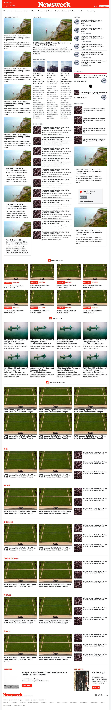

# The Newsweek Page (Using Bootstrap)
This project centers on using bootstrap to build a replica of [Newsweek.com](https://www.newsweek.com/).

 
 
 
 

In this project, my aim was to make a clone of the [Newsweek](https://newsweek.com/) website.

There are some elements on this page which are produced with Javascript but my objective in this project wasn't to give this page functionality.

## Built with
  * [Bootstrap 4](https://getbootstrap.com/)
  * HTML
  * SASS

## Live demo
[Live Demo Link](https://raw.githack.com/PhillipUg/newsweek-clone/newsweek-page/index.html)

## Author

  :bust_in_silhouette: **Author**
 * Github: https://github.com/PhillipUg
 * Twitter: https://twitter.com/Phillip_Ug
 * LinkedIn: https://www.linkedin.com/in/phillip-musiime

## Contributing
Contributions, issues and feature requests are welcome!

   1. Fork the Project
   2. Create your Feature Branch (git checkout -b feature/AmazingFeature)
   3. Commit your Changes (git commit -m 'Add some AmazingFeature')
   4. Push to the Branch (git push origin feature/AmazingFeature)
   5. Open a Pull Request

Feel free to check the [issues page](https://github.com/PhillipUg/newsweek-clone/issues).

## Show your support
Give a :star: if you like this project!

## Acknowledgements
  * [Microverse](https://www.microverse.org/)
  * [The Odin Project](https://www.theodinproject.com/courses/html5-and-css3/lessons/embedding-images-and-video#introduction)

## License
 Distributed under the MIT License.

